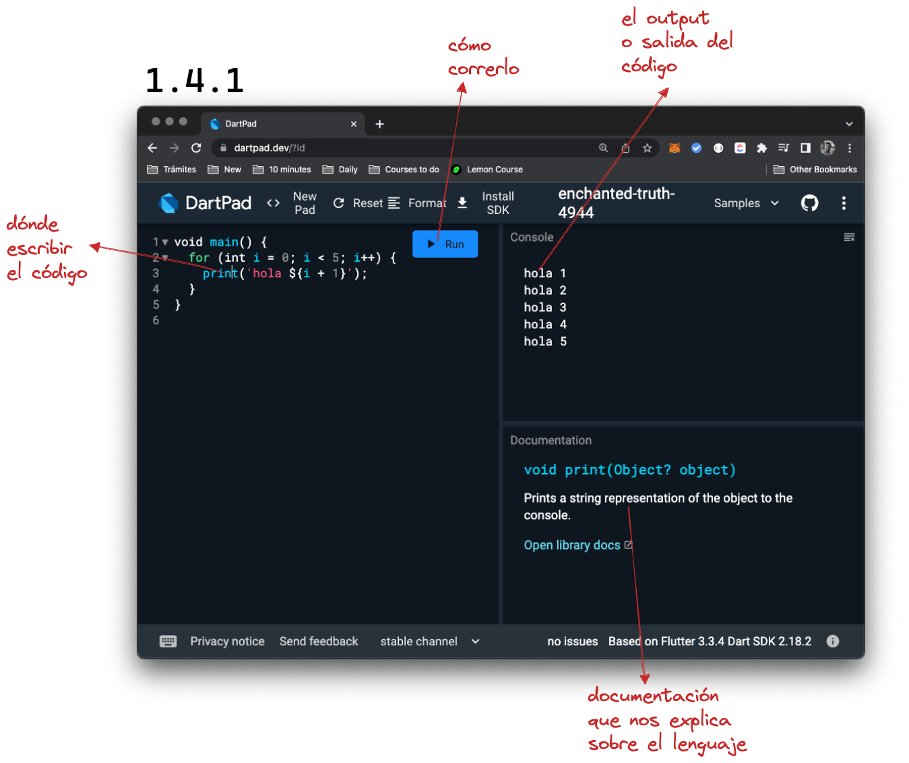
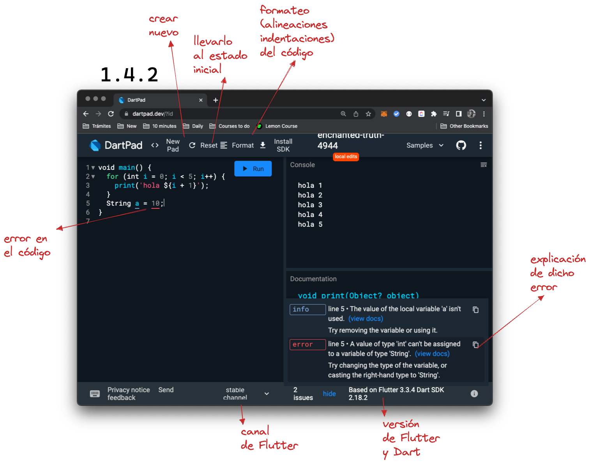

# Introducción a Dartpad

@Mau Di Bert

Dart viene con una herramienta para rápidamente escribir código Dart online y ver el _output_ (la salida, lo que se ve), de dicho código. Esa herramienta se llama [Dartpad](https://dartpad.dev) y es totalmente gratuita. Lo vamos a utilizar para las primeras partes de este curso.

