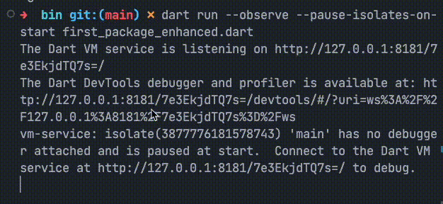
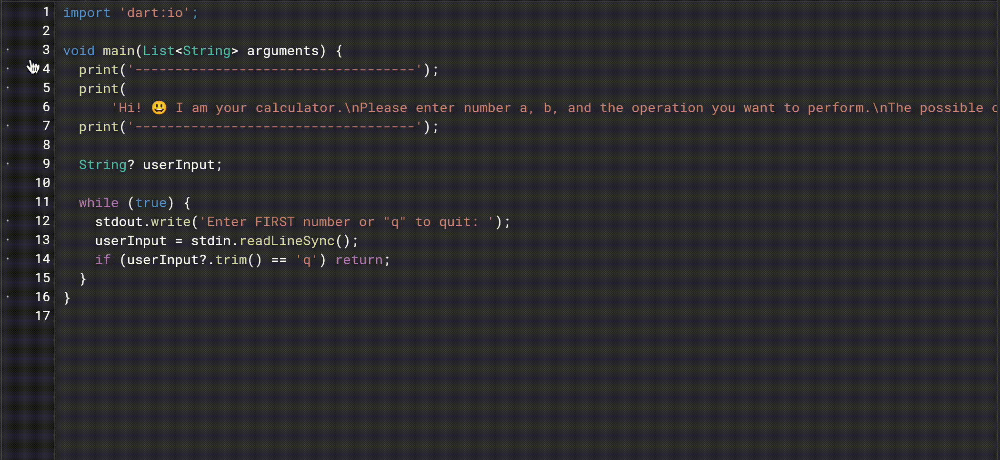

# Dart DevTools

Ya hemos explicado el por qué es tan importante incorporar los tests como una práctica cotidiana, sin embargo, es recién ahora que habiendo absorvido una buena base sobre Dart, que pueden entender más su verdadera importancia. Por ello, vamos a repasar un poco empezando por modificar el último paquete en el que trabajamos, el `first_dart_packages_exercise.dart`.

Para que no se nos haga lío con los archivos, vamos a duplicarlo y nombrarlo `first_package_enhanced`, que significa 'mejorado'. Ah! Un shortcut 🩳: si hacen click en un archivo o carpeta en el árbol de archivos de VSCode y luego `enter`, van a poder renombrarlo rápidamente! 💀 Vayan a practicarlo renombrando todos los archivos con el nombre del nuevo proy... paquete! 😂

Bien! Lo que hacíamos en este paquete no era de lo más útil salvo servir al propósito de explicar cómo crear un paquete pero vamos a dejar la base y darle una vuelta de rosca!

Habíamos creado dentro de nuestra carpeta `/bin`, la encargada de los ejecutables de nuestra línea de comando, un archivo que imprimía resultados al usar nuestra flamante calculadora con los enteros 2 y 6:

```dart
import 'package:first_package_enhanced/first_package_enhanced.dart'
    as first_package_enhanced;

void main(List<String> arguments) {
  first_package_enhanced.printCalculations(2, 6);
}
```

A su vez, este llamaba a la parte compartible de nuestro paquete dentro de la carpeta `/lib`, que a su vez, llamaba al paquete que creamos llamado
`calculator`:

```dart
import 'package:calculator/calculator.dart' as calculator;

void printCalculations(double a, double b) {
  print(calculator.add(a, b));
  print(calculator.divide(a, b));
  print(calculator.multiply(a, b));
  print(calculator.substract(a, b));
}
```

Bueno, vamos a toquetear un poco este programita para volverlo más interesante. Prueben hacerlo ustedes solitos y solitas. Luego, vamos a ir solucionándolo juntos mientras les muestro cómo debuggear en DevTools, que es algo que teníamos pendiente!

## 💪 Una calculadora en la terminal

__Requirements__:

- Volver utilizable la calculadora en la terminal basándose en el ejercicio de la sección 5, ejercicio 5.1_rock_paper_scissors.dart.
- En el archivo `/bin/first_package_enhanced.dart`, van a montar la lógica que le de una bienvenida al usuario y le ofrezca qué opciones tiene nuestra calculadora.
- En el archivo `/lib/first_package_enhanced.dart`, van a crear funciones que les permitan imprimir el resultado mientras reciben los números. Recuerden que cada función tiene que cumplir con un propósito por lo que tendrán que separarlas según las 4 funciones de nuestra calculadora.
- Tal como en el ejemplo, tienen que darle la posibilidad de salir de la calculadora oprimiendo la letra 'q'

## Solution + Debuggear desde las DevTools

Recuerdan que les dije iba a llegar el momento de aprenderlo? Llegó! Justo en el medio del ejercicio que están por hacer! Y seguramente hasta ahora no hayamos tenido mucha necesidad de debuggear pero a medida que la cosa se va poniendo más compleja, más útil nos va a ser.

1. Primero que nada, recuerden actualizar el nombre de todos los archivos y funciones. Deberíamos ver nuestro árbol de archivos y carpetas sin errores salvo la carpeta `/test`.

2. Nos basamos entonces en el `5.1_rock_paper_scissors.dart` para  montar la lógica que le de una bienvenida al usuario y le ofrezca qué opciones tiene nuestra calculadora. Vamos por partes con este punto:

__La bienvenida al usuario__ podría ser algo así:

```dart
void main(List<String> arguments) {
  print('-----------------------------------');
  print(
      'Hi! 😃 I am your calculator.\nPlease enter number a, b, and the operation you want to perform.\nThe possible ones are (a)dd | (s)ubsctract | (m)ultiply | (d)ivide\nEnjoy!');
  print('-----------------------------------');
}
```

Luego, yo quiero que __el programa corra de modo infinito hasta que el usuario introduzca la letra 'q'__ que podríamos implementarlo con un `while` que corra siempre hasta que encuentre su `return`:

```dart
import 'dart:io';

void main(List<String> arguments) {
  print('-----------------------------------');
  print(
      'Hi! 😃 I am your calculator.\nPlease enter number a, b, and the operation you want to perform.\nThe possible ones are (a)dd | (s)ubsctract | (m)ultiply | (d)ivide\nEnjoy!');
  print('-----------------------------------');

  String? userInput;

  while (true) {
    stdout.write('Enter FIRST number or "q" to quit:\n');
    userInput = stdin.readLineSync();
    if (userInput?.trim() == 'q') return; // recuerden que el trim lo utilizamos para eliminar cualquier espacio en blanco antes o después del caracter que queremos
  }
}
```

Ahora bien... cómo podríamos probar esto a medida que lo vamos haciendo? Si yo lo corro desde VSCode a modo de debug, no tengo manera alguna de introducir como un usuario en la terminal; si lo corro desde la terminal, no tengo modo de debuggearlo en VSCode (al menos hasta la fecha!). Para ello, usamos las DevTools!

### Cómo utilizamos las DevTools?

Vayan a la carpeta bin y en lugar de solo correr `dart [nombre_del_archivo]`, pongan lo siguiente: `dart run --observe --pause-isolates-on-start [nombre_del_archivo]`. Qué estamos diciendo acá? Primero que corra nuestro programa pero en modo debug `--observe` y que lo pause al comienzo `--pause-isolates-on-start`. Si lo hacen sin este último comando, no van a poder ir punto por punto sino que lo corre hasta el final sin detenerse.

Bien! Le dieron `enter` y ahora apareció este montón de cosas raras:

```shell
The Dart VM service is listening on http://127.0.0.1:8181/7e3EkjdTQ7s=/
The Dart DevTools debugger and profiler is available at: http://127.0.0.1:8181/7e3EkjdTQ7s=/devtools/#/?uri=ws%3A%2F%2F127.0.0.1%3A8181%2F7e3EkjdTQ7s%3D%2Fws
vm-service: isolate(3877776181578743) 'main' has no debugger attached and is paused at start.  Connect to the Dart VM service at http://127.0.0.1:8181/7e3EkjdTQ7s=/ to debug.
```

Por ahora en lo único que quiero que se concentren es en la línea que dice `The Dart DevTools debugger and profiler is available at: http://127.0.0.1:8181/7e3EkjdTQ7s=/devtools/#/?uri=ws%3A%2F%2F127.0.0.1%3A8181%2F7e3EkjdTQ7s%3D%2Fws`. Vayan allí con su mouse y van a ver que si solo se paran arriba, sin tocar ninguna tecla (esto es hacer _hover_), su terminal lo subraya. Esto significa que se trata de un _link_. Ahora, si presionamos además la tecla `cmd` o `ctrl`, cambia a una mano:



Hagan click mientras presionan `cmd` o `ctrl` entonces y les va a abrir en una ventana del último navegador con el que estuvieron interactuando, las flamantes DevTools y allí y por ahora, solamente vamos a trabajar con el debugger:


Pueden ver que es muy similar a lo que teníamos en VSCode: a la izquierda los paneles 'Call Stack', 'Variables' y 'Breakpoints' (fíjense que están invertidos a como solemos verlo en VSCode pero siguen siendo los mismos paneles) y a la derecha la 'Barra de Control' solo que ahora figura el nombre completo de lo que cada botón realiza y luego algo que en VSCode tenemos en el panel de 'Breakpoints' que es cuándo deseamos que nuestro código se detenga (y varias de estas cosas ya las veremos pronto):

Que el código...

1. _Don't stop on exceptions_: no pare nunca, no importa si hay _exceptions_ o no.
2. _Stop on uncaught exceptions_: pare solamente en aquellas _exceptions_ que no tengamos controladas con nuestro propio código.
3. _Stop on all exceptions_: pare en todas las _exceptions_ que se produzcan.

Suelo utilizarlo en _Stop on uncaught exceptions_ ya que se estaría deteniéndose en _exceptions_ que no tengamos controladas pero es algo ya veremos pronto!

### Seteando breakpoints

Si se paran encima de los pequeños puntitos a la izquierda de cada línea, van a poder hacer click y determinar allí sus _breakpoints_; ya no se ponen rojos como en VSCode sino que agrandan un poco su tamaño:



Vamos a poner uno en la línea 14 y vamos a darle a `Resume`. En su terminal como en el panel 'Console' de las DevTools, van a ver impreso los `print` que ya pusieron y el que les pide por su primer número o la 'q' para quitarlo.

Una vez allí, introduzcan un número cualquiera, por ejemplo el 3 y luego `enter`. Van a observar cómo se movió hasta la línea 14, que es donde lo detuvimos y luego en nuestra terminal de VSCode salieron un par de cosas (`vm-service: isolate (2909629860491151) 'main' has no debugger attached and is paused.  Connect to the Dart VM service at <http://127.0.0.1:8181/JLOuvbvZb6g=/> to debug.`) que básicamente nos dice que está pausado. Lo imporante de aquí es que nos permite asegurarnos de que está leyendo correctamente lo que introdujimos en la terminal, si vamos al panel 'Variables'.

Opriman una vez más en `Resume` y verán nuevamente el pedido de _input_. Prueben introducir la letra 'q' y ver si efectivamente el programa se detiene haciendo nuevamente click en `Resume`. Por alguna razón que aun desconozco, 😅, tienen que volver a hacer click en `Resume` y allí van a ver que su programa finalizó.

### Continuando con la solución

Bien! Ya nos aseguramos que podemos cortar nuestra calculadora cuando queremos. Vamos a ir más rápido ahora y si están siguiendo esto paso a paso sin haber hecho el ejercicio, 💀 pruben avanzar ustedes pidiendo todas las variables que necesitamos: número 1, número 2 y operación y despidiéndonos del usuario:

```dart
import 'dart:io';

void main(List<String> arguments) {
  print('-----------------------------------');
  print(
      'Hi! 😃 I am your calculator.\nPlease enter number a, b, and the operation you want to perform.\nThe possible ones are (a)dd | (s)ubsctract | (m)ultiply | (d)ivide\nEnjoy!');
  print('-----------------------------------');

  while (true) {
    String? a;
    num? numA;
    String? b;
    num? numB;
    String? operation;

    do {
      stdout.write('Enter FIRST number or "q" to quit: ');
      a = stdin.readLineSync();
      if (a?.trim() == 'q') return;
      numA = num.tryParse(a!);
    } while (numA == null);

    do {
      stdout.write('Enter SECOND number or "q" to quit: ');
      b = stdin.readLineSync();
      if (b?.trim() == 'q') return;
      numB = num.tryParse(b!);
    } while (numB == null);

    do {
      stdout.write(
          'Select OPERATION\n(a)dd\n(s)ubsctract\n(m)ultiply\n(d)ivide\nor "q" to quit: ');
      operation = stdin.readLineSync();
      if (operation?.trim() == 'q') return print('Thanks for the use! ❤️');
    } while (operation != null && operation.trim() == 'q');
  }
}
```

Ahora podemos ver paso a paso y cuando lo necesitamos en nuestras DevTools lo que está sucediendo!

Vamos ahora a crear una función que imprima el resultado de sumar, restar, multiplicar y dividir, dentro de nuestra librería (`/lib`). Recuerden que lo hacemos de forma separada porque una función debería tener solamente un propósito y mantenerse pura, sin efectos secundarios:

```dart
import 'package:calculator/calculator.dart' as calculator;

void printSumOf(num a, num b) =>
    print('= The result of adding $a and $b is: ${calculator.add(a, b)}');
void printSubstrctionOf(num a, num b) => print(
    '= The result of substracting $a to $b is: ${calculator.substract(a, b)}');
void printMultiplicationOf(num a, num b) => print(
    '= The result of multiplying $a and $b is: ${calculator.multiply(a, b)}');
void printDivisionOf(num a, num b) =>
    print('= The result of dividing $a by $b is: ${calculator.divide(a, b)}');

```

Y vamos a agregar esto en nuestro programa, poniendo un saludo al final:

```dart
import 'dart:io';

import 'package:first_package_enhanced/first_package_enhanced.dart'
    as first_package_enhanced;

void main(List<String> arguments) {
  print('-----------------------------------');
  print(
      'Hi! 😃 I am your calculator.\nPlease enter number a, b, and the operation you want to perform.\nThe possible ones are (a)dd | (s)ubsctract | (m)ultiply | (d)ivide\nEnjoy!');
  print('-----------------------------------');

  while (true) {
    String? a;
    num? numA;
    String? b;
    num? numB;
    String? operation;

    do {
      stdout.write('Enter FIRST number or "q" to quit: ');
      a = stdin.readLineSync();
      if (a?.trim() == 'q') return;
      numA = num.tryParse(a!);
    } while (numA == null);

    do {
      stdout.write('Enter SECOND number or "q" to quit: ');
      b = stdin.readLineSync();
      if (b?.trim() == 'q') return;
      numB = num.tryParse(b!);
    } while (numB == null);

    do {
      stdout.write(
          'Select OPERATION\n(a)dd\n(s)ubsctract\n(m)ultiply\n(d)ivide\nor "q" to quit: ');
      operation = stdin.readLineSync();
      if (operation?.trim() == 'q') return print('Thanks for the use! ❤️');
    } while (operation != null && operation.trim() == 'q');

    switch (operation) {
      case 'a':
        first_package_enhanced.printSumOf(numA, numB);
        break;
      case 's':
        first_package_enhanced.printSubstrctionOf(numA, numB);
        break;
      case 'm':
        first_package_enhanced.printMultiplicationOf(numA, numB);
        break;
      case 'd':
        first_package_enhanced.printDivisionOf(numA, numB);
        break;
    }
    print('-----------------------------------');
    print("Let's go again! 🧮");
    print('-----------------------------------');
  }
}
```

Genial! Ya tendríamos todo listo, salvo que nuestros tests están fallando! Qué mejor lugar para empezar un próximo capítulo que el teniendo un test fallador! 🤣
