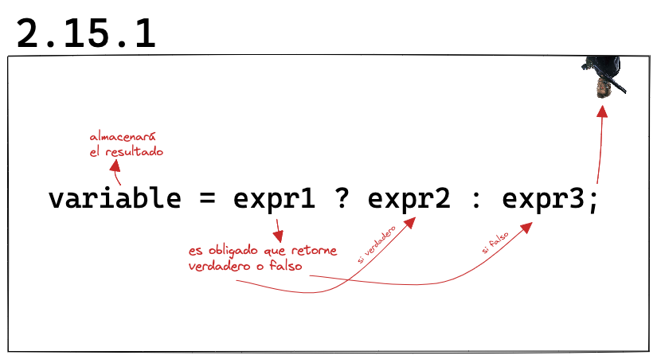

# Conditional operator u operador condicional

@Mau Di Bert

Supongamos que queremos escribir un programa que nos permita introducir la edad que tenemos y determinar si somos mayores o menores de edad. Haríamos algo así, de atrás para adelante:

- Imprimir en pantalla si somos mayores o menores de edad.
- Calcular en una variable si somos mayores o menores de edad y retornarlo.
- Crear una variable para almacenar el resultado de la operación que haremos.
- Guardar la variable de nuestra edad.

Ahora que tenemos una __pseudo idea de los pasos__, vamos a ordenarlos como requirement:

__Requirement__:

1. Guardar nuestra edad en una variable `int`.
2. Crear una variable `String` en la que almacenaremos el resultado.
3. Calcular si somos mayores o menores.
4. Almacenarlo en la variable de resultado.
5. Imprimirlo en pantalla.

Bien! Vamos lento pero les aseguro que seguro! 😂 Seguimos de a poco:

```dart
void main() {
    int myAge = 38;
    String isUnderAge;
    // 🤨 y ahora? Cómo lo calculamos?
}
```

Sabemos que la mayoría de edad es a los 18 años (por lo menos en Argentina) por lo que deberíamos chequear si nuestra variable es mayor o menor que ese límite de edad verdad? Podríamos crear otra variable que almacene ese límite de edad ya que por ejemplo, lo podríamos cambiar según el país en donde nos encontremos:

```dart
void main() {
    int myAge = 38;
    int underAgeLimit = 18;
    String isUnderAge;
    // 🤨 y ahora? Cómo lo calculamos?
}
```

Luego, podríamos utilizar los operadores ya conocidos para ver si nuestra edad es igual o mayor que el límite de edad, ya que al momento de cumplir los 18 años, se nos considera adultos: `myAge >= underAgeLimit`.

Esto sin embargo, qué arroja como resultado? 💀 Deberían ya mismo estar probándolo!

Retorna un `bool`! Pero nosotros queremos imprimir en la consola algún mensaje un poco más _user friendly_ (amistoso para el usuario), en lugar de decirles _true_ o _false_. Ay! Si tan solo tuviéramos...

## Conditional operator o Ternary operator

Traducido como operador condicional o ternario, nos permite __evaluar una expresión como verdadera o falsa y retornar la expresión que queramos__ , siempre y cuando sean del mismo tipo. Conceptualmente, veríamos algo así:



Parecería que nos viene como anillo al dedo para terminar nuestro pequeño programa. 💀 Estoy absolutamente convencido que antes de ver cómo quedaría el programa terminado, quieren intentarlo ustedes mismos!

```dart
void main() {
    int myAge = 38;
    int underAgeLimit = 18;
    String isUnderAge = myAge >= underAgeLimit ? 'Yes. He is an Adult.' : 'No. He is a child.';
    print('Is Mau an adult? $isUnderAge');
}
```

Como verán, tenemos el programa listo... o ... casi listo! 🧐 Si nos ponemos meticulosos, la variable que almacena el resultado es `isUnderAge` que significa si está por debajo del límite de edad pero en realidad, cuando iba escribiendo el `print` me di cuenta que quería expresar si era un adulto o un niño y preguntarlo tal como lo hice. Para poder probarlo, avancé pero sabiendo que tendría que cambiar luego la variable `isUnderAge` por otra como `isAndAdult`.

Este tipo de comportamiento que todos tenemos con el objetivo de movernos más rápido, no suele ser eficaz el grueso de las veces. Ahora, el programa no falló y estamos próximos de aquello que queremos cambiar. No obstante, no es siempre el caso, nos enredamos en complicaciones y nos olvidamos de aquello que debíamos cambiar. Aun sin lograrlo yo mismo la mayor parte del tiempo, sigo recomendado esta forma.

```dart
void main() {
    int myAge = 38;
    int underAgeLimit = 18;
    String isAnAdult = myAge >= underAgeLimit ? 'Yes. He is an Adult.' : 'No. He is a child.';
    print('Is Mau an adult? $isAnAdult');
}
```
