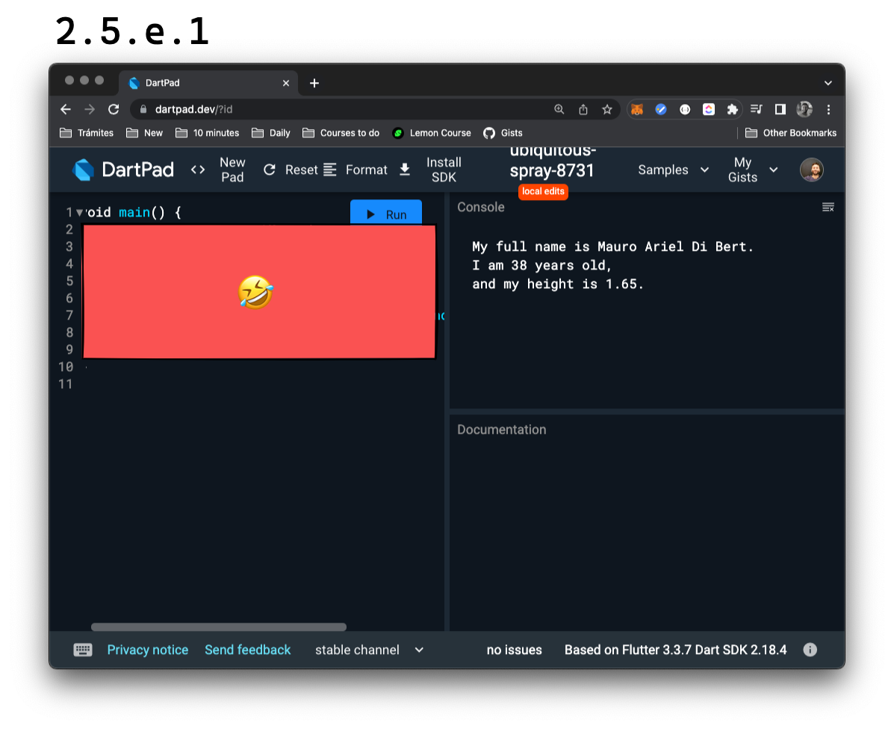

# Basic types o tipos básicos

@Mau Di Bert

Cuando decimos tipos básicos, nos referimos a las distintas cajas que tenemos para almacenar valores, pero específicamente, a las más sencillas de utilizar.

Ya conocemos la caja de tipo `String`. Vamos a sumar algunas más:

`int`: sirve para almacenar números enteros de hasta 64 bits de precisión. Podrían probar guardando su edad e imprimiéndola? Les dejo la base que va a romperse:

```dart
void main() {
    print(myAge);
}
```

💀

Cómo lo resolvieron? Yo hice algo así:

```dart
void main() {
    int myAge = 38;
    print(myAge);
}
```

`double`: sirve para guardar números que tengan parte decimal, con 32 bits de precisión. 💀 Qué tal si representan su _height_ o estatura? Ojo que les pego directamente mi solución; ustedes vayan a probarlo solos!

```dart
void main() {
    double myHeight = 1.65;
    print(myHeight);
}
```

`bool`: sirve para representar dos valores, `true` y `false`, verdadero o falso. 🤓: Recibe su nombre del matemático inglés que lo describió como un sistema formal de la lógica, el célebre George Boole. 💀 Y si representan la respuesta de preguntarse si les gusta este curso? 🤣

```dart
void main() {
    bool doILoveThisCourse = true;
    print(doILoveThisCourse);
}
```

Perfecto! Estos tipos básicos son también conocidos como _built-in types_ en Dart y los van a utilizar mucho!

Ahora, una última cosa: qué pasa si escriben lo siguiente? 💀 Pueden entender por qué hay un error?

```dart
void main() {
    bool doILoveThisCourse = True;
    print(doILoveThisCourse);
}
```

## Case sensitive o sensible a mayúsculas y minúsculas

Dart reconoce entre minúsculas y mayúsculas, y los booleanos pueden llevar solamente dos valores `true` o `false`. `True` no es lo mismo que `true` para Dart, de la misma forma que no lo es `False`. Estén atentos a esto!

## 💪 a imprimir variables

Vamos a ir alternando con algunas ejercitaciones un poco más largas que otras y por ello van a tener un lugar especial dentro del artículo que reconocerán por este emoji 💪. Recuerden que si quieren más ejercicios, un lugar donde consultar dudas o conocerse con nosotros y otros fanáticos del código, pueden [sumarse a nuestra comunidad gratuita en Discord](https://discord.gg/vpPVf7guPC)!

Cada ejercicio se va a componer de un _requirement_ y una o varias soluciones propuestas para resolverlo. Algunas veces, podremos introducir los pasos que llevamos para lograrlas. Sin embargo, recuerden siempre seguir el método propuesto de:

1. Leer qué es lo que se requiere lentamente. Si puede dividirse, hacerlo en partes más pequeñas, o _sub-requirements_.
2. Crear el código de fin a principio, como un test para ir recibiendo la ayuda de Dart para arreglarlo.
3. Proponer una solución final y chequear nuevamente para ver si los _requirements_ fueron satisfechos de forma correcta.

__Requirement__: almacenar variables para luego imprimirlas de forma tal que la consola muestre algo como la siguiente imagen y que utilicen para componer el nombre completo, una variable para el primer nombre, una variable para el segundo (si lo tuvieran) y una variable para el apellido; utilicen sus propios nombres y datos:



__💀 Solución__:

```dart
void main() {
  String myFirstName = 'Mauro';
  String mySecondName = 'Ariel';
  String myLastName = 'Di Bert';
  int myAge = 38;
  double myHeight = 1.65;
  print('My full name is $myFirstName $mySecondName $myLastName.');
  print('I am $myAge years old,');
  print('and my height is $myHeight.');
}
```
