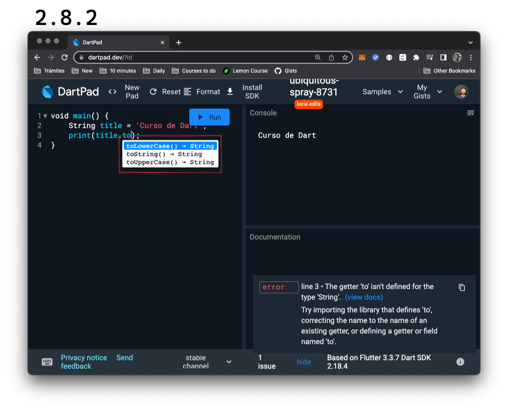

# Métodos comunes en textos

@Mau Di Bert

Para empezar, vamos a definir una variable con el siguiente texto: 'Curso de Dart' y vamos a imprimirlo en consola:

```dart
void main() {
    String title = 'Curso de Dart';
    print(title);
}
```

Hasta aquí, nada nuevo. Cómo haríamos sin embargo, para transformar ese título a mayúsculas, sin hacerlo cambiando cada caracter?

Si nos paramos junto a la variable y añadimos un punto, vamos a ver en nuestro Dartpad, un listado de métodos que los `String` contienen: 

Si luego introducimos la palabra _'to'_, vamos a ver que la lista de operaciones se reduce a tres:



Allí, simplemente bajamos con la flecha hasta donde dice _'toUpperCase'_ o 'a mayúsculas' y damos en la tecla 'tab' o en la tecla 'enter' para autocompletar. Así entonces, nos encontramos con una expresión que convierte todos los caracteres del contenido de la variable `title`, a mayúsculas. Prueben correr el código para ver que funcione!

## Methods o métodos

Viendo la expresión `print(title.toUpperCase())` con detalle, sabemos que `title`, es una variable que guarda una cadena de texto o `String`. Qué es sin embargo `toUpperCase`? Un método!

Un método es __una o varias operaciones que pueden realizarse sobre una determinada _variable_ u _object_ (objeto)__. Para _llamarlo_ utilizamos '.' o _dot operator_ y para _ejecutarlo_, los '()': __Object.method()__.

Por otro lado, también podemos observar que `print(...)` realiza una operación y es llamado con paréntesis. Si bien van a escuchar llamarlo 'método', se trata de una _function_ o función.

Finalmente, el método _toUpperCase_ puede aplicarse a todas las `String`. En el caso anterior lo aplicamos a una variable pero también podría hacerse sobre una _string literal_ o cadena literal de texto: `title = 'Dart course'.toUpperCase()`. De esta manera, la variable contendría ya el texto en mayúsculas.

💀 Prueben ahora pasar todo a minúsculas! Solo tienen que indagar en los otros dos métodos restantes que ofrece el _object_ `String`, cuando comienzan con _to_.

```dart
void main() {
    String title = 'Curso de Dart';
    print(title.toLowerCase());
}
```

Bien simple no?
