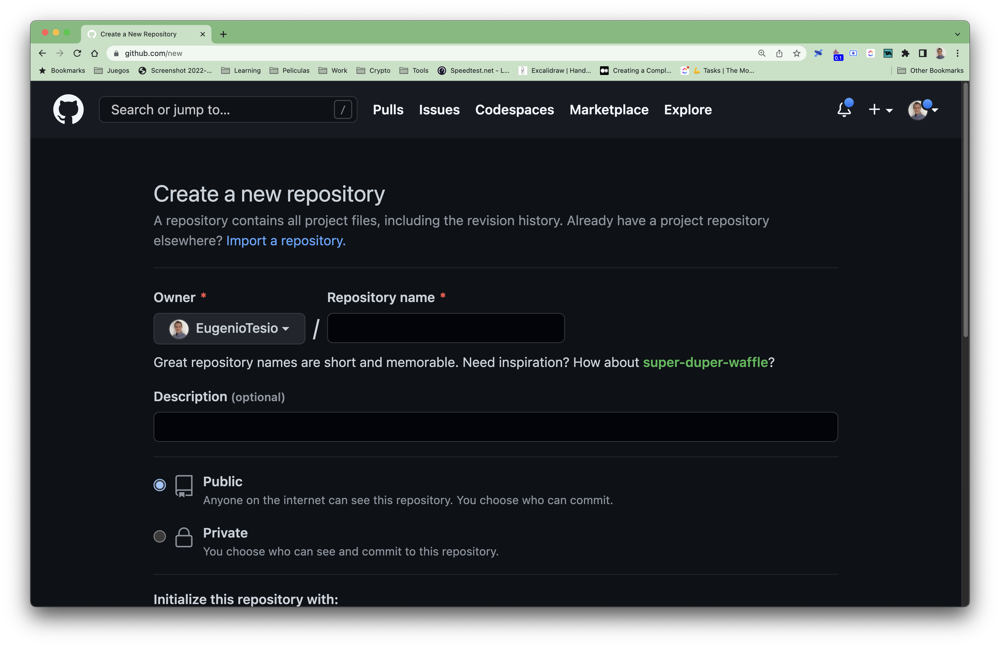
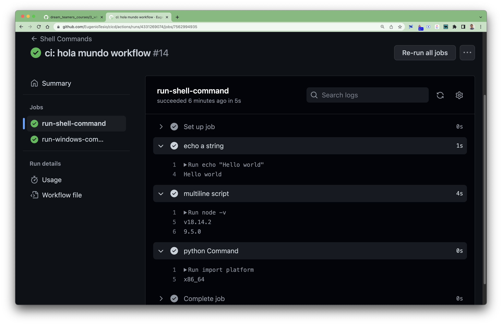

# GitHub Actions Hola Mundo

@Eugenio Tesio

## Visión general de la herramienta

Antes de comenzar a escribir nuestra primer Action vamos a ver un poco que nos ofrece GitHub Actions para poder desarrollar nuestro proceso de integración contínua.

GitHub Action utiliza los eventos internos del repositorio GitHub para disparar los flujos de trabajos, __Workflows__, creados por nosotros. Algunos de estos eventos pueden ser:

- Push
- Pull request:
  - open
  - merge
  - close
- Issue:
  - created
  - closed
- Programados (ej: cada 24 hs)
- Eventos externos

De esta forma podríamos pensar, por ejemplo, en enviar un mensaje de Slack a nuestro equipo de desarrollo cada vez que un usuario crea una Issue en nuestro repositorio, o bien crear un ticket en nuestra herramienta de Project Management (suponiendo que dispone de las API's necesarias para esta operación).

## :computer: Workflows

Los flujos de trabajo o Workflows son una serie de trabajos que se ejecutan luego de ocurrido un evento, por ej: despues de un push. Los workflows son estructurados en archivos __YAML__ dentro de un subdirectorio especial (en donde GitHub Actions leera los mismos) que por defecto es .github.

Puede haber más de un archivo __YAML__ dentro de la carpeta, indicando que existen más de un workflow, que inclusive pueden estar disparados por el mismo evento. Estos nos permite organizar nuestros workflow de manera ordenada con una buena división responsabilidades entre ellos.

Dentro de los Workflows, existen distintos __trabajos (Jobs)__ que su vez tienen __pasos (Steps)__. A continuación se muestra el esquema de como está organizado un Workflow:


## :runner: Runners

A esta altura se preguntaran, "muy lindo todo... pero ¿como trabaja por dentro, que es lo que permite ejecutar los Jobs de los Workflows?". La respuesta es Runners. Estos son maquinas virtuales con Linux o MacOS o Windows que se crean cuando reciben un evento y que internamente tienen instalado un software llamado GitHub Action runner, el cual nos permite ejecutar nuestros Jobs. Los runners también tienen instalados un stack de software comunmente utilizado para desarrollo:

- curl, npm, git, yarn, pip.
- python, ruby, nodeJS.
- AndroidSDK y Xcode.

## :hammer: Manos a la obra

Llegó la hora, Basta de tanto texto abstracto, comencemos a crear nuestro primer Workflow y aprendamos con ejemplos.

Comenzaremos creando el repositorio en nuestra cuenta de GitHub (creense una cuenta en caso de no tenerla), para lo cual podemos acceder a https://github.com/new. En mi caso llamaré al repositorio __cicd__.



Luego de crear el repositorio en GitHub, vamos a inicializarlo en nuestro local, reemplazando el origen por la URL de su repositorio.

```bash
echo "# cicd" >> README.md
git init
git add README.md
git commit -m "first commit"
git branch -M main
git remote add origin https://github.com/EugenioTesio/cicd.git
git push -u origin main
```

Antes de comenzar a trabajar con el archivo __YAML__ les recomiendo instalar la extensión en VSCode que detectará que el archivo es un GitHub Action y nos facilitará el autocompletado de código, lo cual hace nuestras vidas más fáciles.

    Name: YAML
    Id: redhat.vscode-yaml
    Description: YAML Language Support by Red Hat, with built-in Kubernetes syntax support
    Version: 1.10.1
    Publisher: Red Hat
    VS Marketplace Link: https://marketplace.visualstudio.com/items?itemName=redhat.vscode-yaml

Comenzaremos creando el primer __Workflow__, al cual llamaremos ```hello_world.yml```.

```bash
mkdir .github
cd .github
mkdir workflows
cd workflows
nano hello_world.yml
```

y escribiremos las siguiente líneas de código.

```yml
name: Shell Commands # Nombre del workflow.

on: [
  push # Acción en la cual se va a ejecutar el workflow.
]

jobs:
  run-shell-command: # Nombre del primer trabajo del workflow.
    runs-on: ubuntu-latest # Máquina virtual en la cual se va a ejecutar.
    steps:
      - name: echo a string # Nombre del primer paso.
        run: echo "Hello world" # Comando que ejecutará el primer paso.
      - name: multiline script # Nombre del segundo paso.
        run: | # Operador para ejecutar multiples comandos
          node -v
          npm -v
      - name: python Command # Tercer paso.
        run: |
          import platform
          print(platform.processor())
        shell: python # Consola a utilizar.
  run-windows-commands: # Nombre del segundo trabajo.
    runs-on: windows-latest # Utilizará una máquina virtual de Windows.
    needs: [
      'run-shell-command' # Necesita que run-shell-command esté instalado
    ]
    steps:
      - name: Directory PowerShell
        run: Get-Location
      - name: pwd
        run: bash
```

Luego, después de grabar los cambios, realizaremos el ```commit``` y el ```push``` de los cambios.

```bash
git add .
git commit -m"ci: hola mundo workflow"
git push origin main
```

En la pestaña de Actions en nuestro proyecto de GitHub veremos los resultados de los trabajos y su salida.


==NOTA: se puede ver como los trabajos han sido ejecutados uno a continuación del otro. Por defecto, al declarar los trabajos, estos se ejecutan siguiendo un orden secuencial.==

Si hacemos click dentro de cada __Job__ veremos las salidas de cada uno.




En el tercer paso del trabajo __run-linux-commands__ se puede ver un etiqueta especial ```shell```, la cual está instruyendo a GitHub Actions a que ejecute el commando en otra consola, en este caso __Python__. El mismo resultado se podría obtener si se crea un archivo ```hola_mundo.py``` que contenga las líneas:

```python
import platform
print(platform.processor())
```

y ejecutando:

```bash
python hola_mundo.py
```

Hay muchos __shells__ disponibles dependiendo del sistema operativo que se utilice, estos están detallados en la documentación de GitHub [link](https://docs.github.com/en/actions/using-workflows/workflow-syntax-for-github-actions#using-a-specific-shell).
