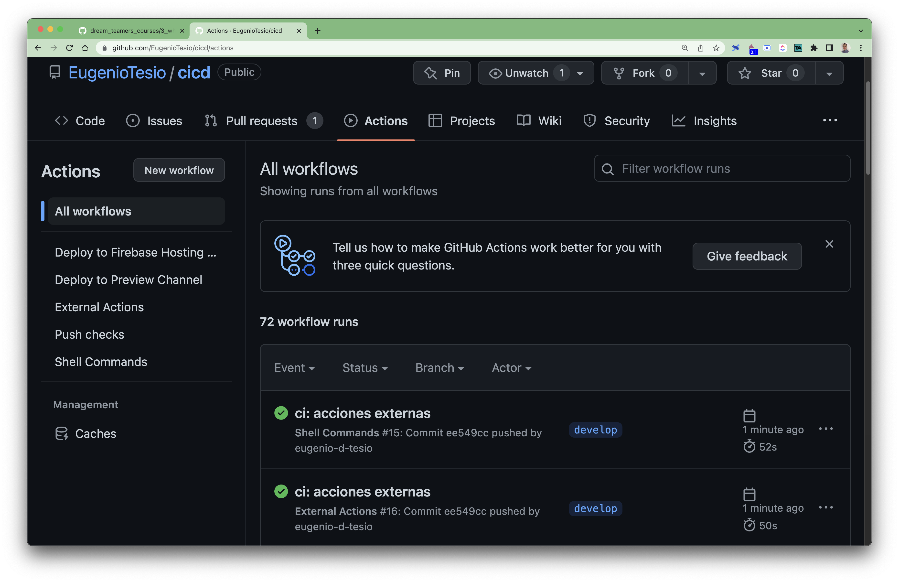

# Acciones Externas

@Eugenio Tesio

Así como podemos crear nuetros propios trabajos, es posible también utilizar acciones de otros desarrolladores hosteadas en _GitHub_, lo cual nos facilita mucho más el trabajo de integración. A continuación vamos a crear un nuevo __Workflow__ invocando a una acción externa y pasandole parámetros.

## Hola mundo con acción externa

Utilizaremos esta [acción externa](https://github.com/EugenioTesio/hello-world-dart-action)  que hemos creado para el proposito de éste curso, la cual es un buen ejemplo para los que les interese crear un acción. Podemos ver que es en realidad un _hello world_ escrito en __Dart__ que acepta un parámetro de entrada `who-to-greet` y podemos capturar un resultado de salida `time`.

Comenzaremos creando un nuevo archivo de __Workflow__ al cual llamaremos `acciones_externas.yml`. Para ello, nos ubicamos en el root del proyecto ya creado y ejecutamos las siguientes líneas de código:

```bash
cd .github/workflows
nano acciones_externas.yml
```

Luego copiamos las líneas de codigo del __snippet__, las cuales explicaremos a continuación.

```yml
name: External Actions # Nombre del workflow.

on: [push] # Se ejecutará al hacer push en cualquier rama.

jobs:
  run-external-action: # Nombre del primer trabajo.
    runs-on: ubuntu-latest # Máquina virtual en la que corre.
    steps:
      - name: Hello world Dart # Nombre del primer paso.
        id: hw # Identificador único que será utilizado luego para obtener los resultado.
        uses: EugenioTesio/hello-world-dart-action@v1.0 # Acción externa a utilizar. El nombre de la acción se conforma eliminado http://github.com/ a la url del repositorio.
        with:
          who-to-greet: Mauro # Asignación de valor a la variable requerida.
      - name: Log output # Paso para impresión de la salida del paso anterior.
        run: echo ${{ steps.hw.outputs.time }}
```

Con respecto a la acción externa, en este caso utilizamos el TAG `v1.0` ya que así lo indica la documentación, pero no es la única opción, podemos también utilizar:

- _Nombre de la rama:_ `EugenioTesio/hello-world-dart-action@main`
- _El hash de un commit específico:_ `EugenioTesio/hello-world-dart-action@45a902258783cf077787f4652051fb531a2e6a1b`

Por último haremos el commit y el push.

```bash
git add .
git commit -m "ci: acciones externas"
git push origin main
```

El resultado del Workflow se muestra en la siguiente imagen:




Al abrir el paso __Hello world Dart__ podremos apreciar que se imprimió en consola "Hello Mauro" y en el paso __Log output__ la fecha de la variable `time`.
