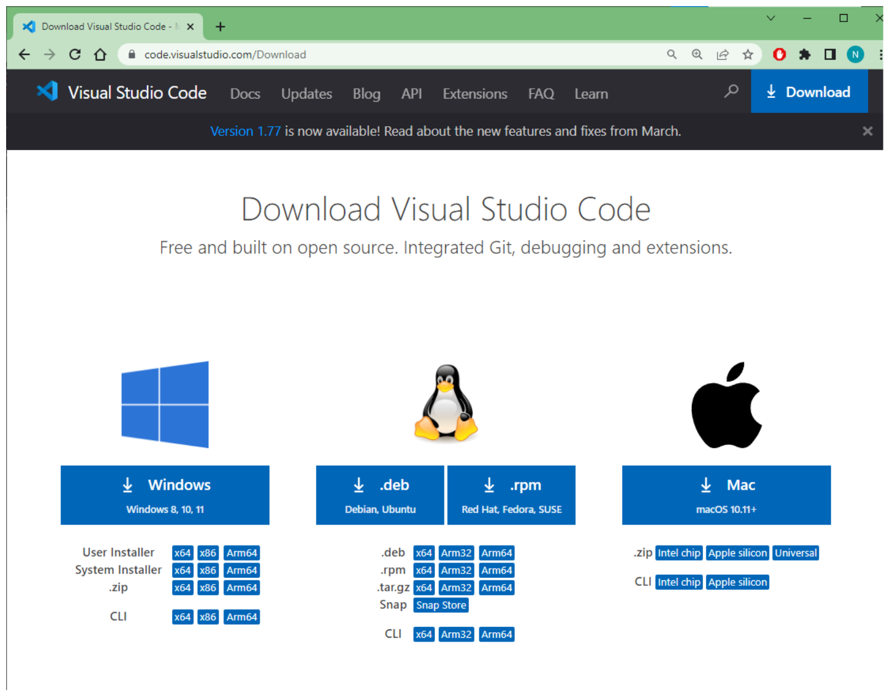
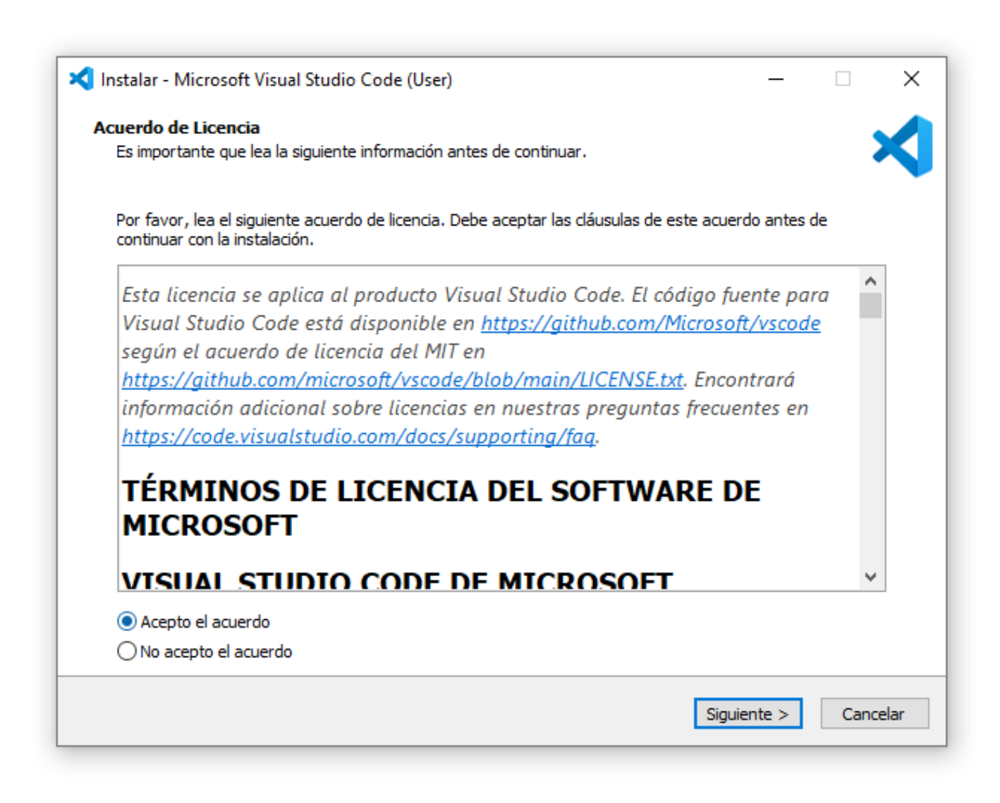
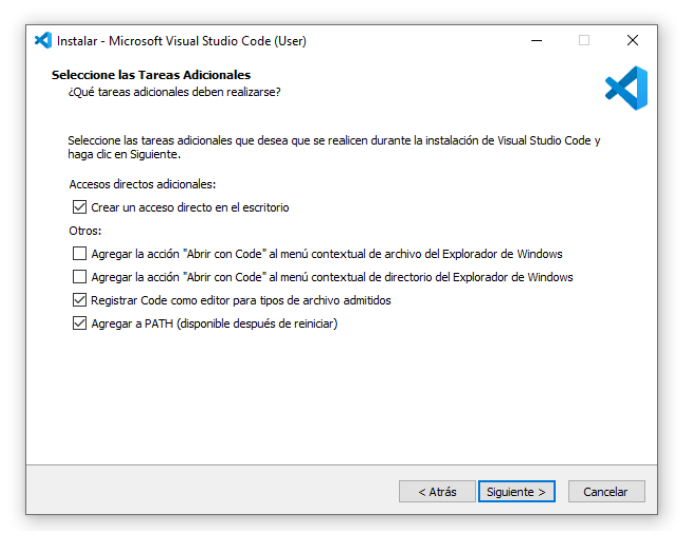
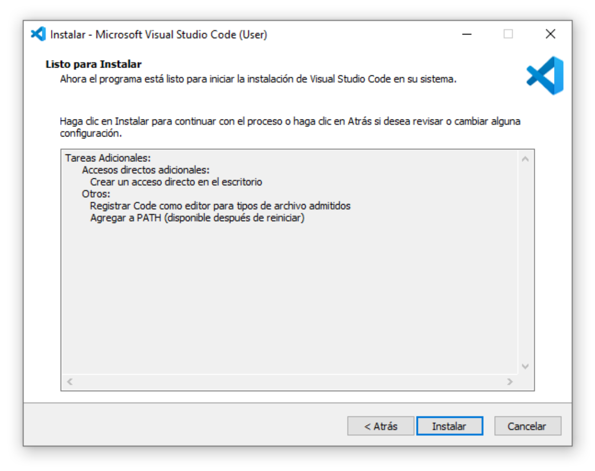
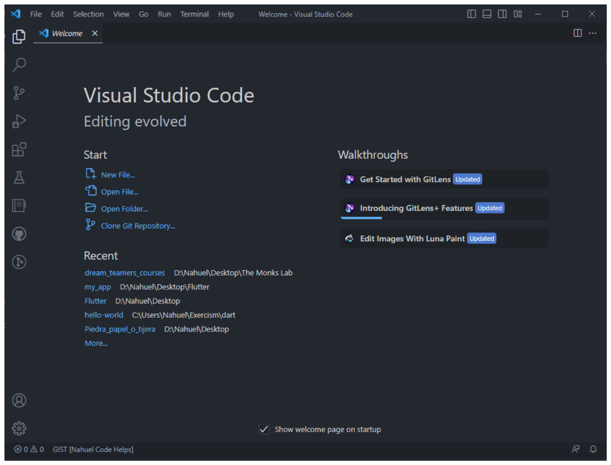
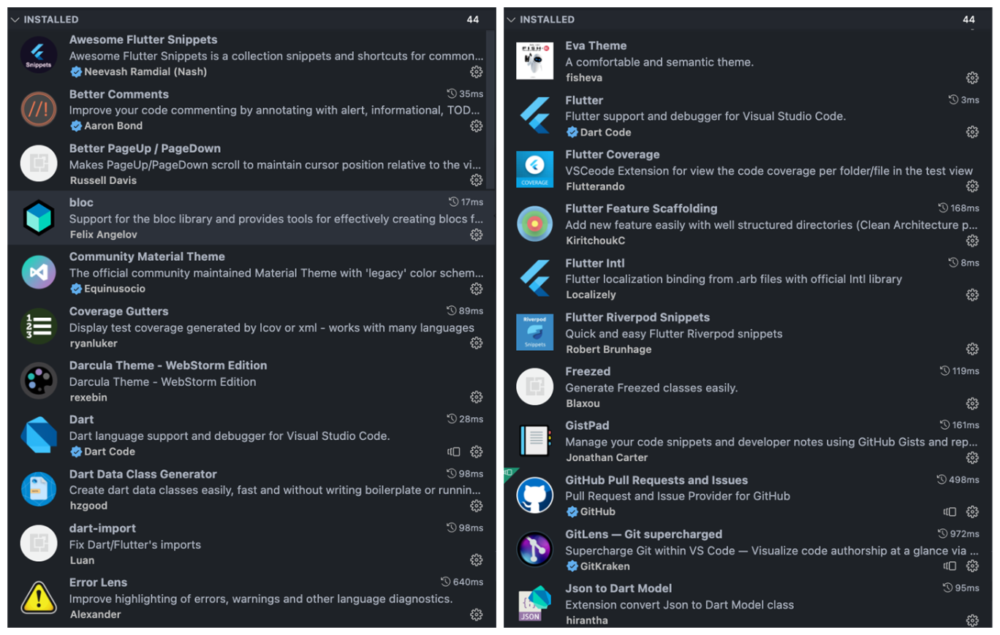
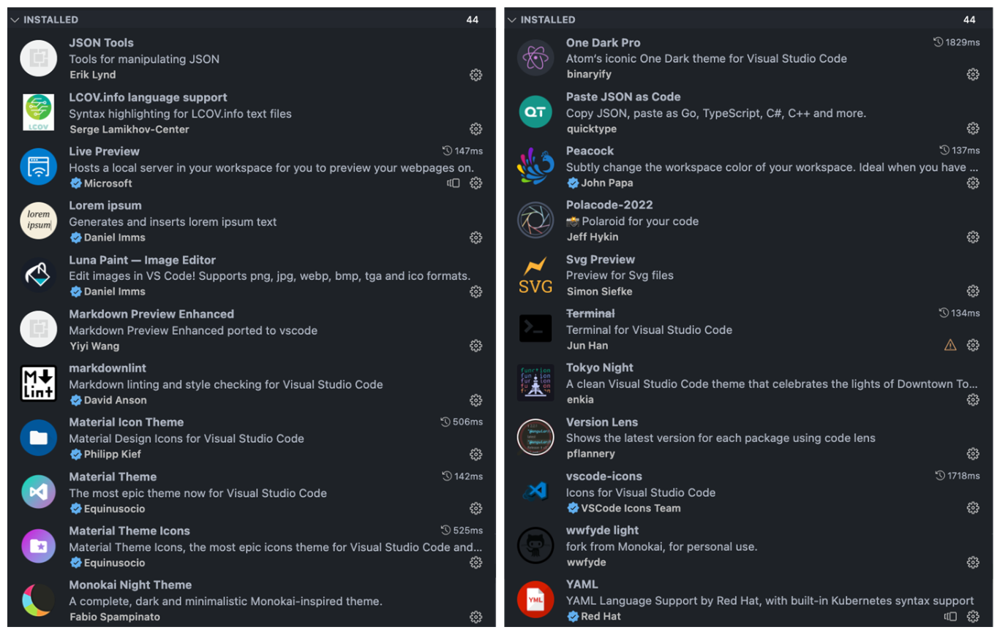

# Crear, correr y debuggear en VS Code

Qué es VS Code? Es __nuestro editor de código favorito__ ya que es sumamente __popular__, lo que significa que __evoluciona constantemente__ y por ellos tiene un __montón de plugins y extensiones__ (agregados al programa para ofrecer funcionalidad) y es __super liviano__!

Vamos a instalarlo:

Antes que nada debemos descargarlo y lo haremos desde su _web page_ siguiendo este [link](https://code.visualstudio.com/Download). Allí elegiremos la opción de acuerdo a nuestro sistema operativo y descargamos el instalador.

## Para Windows

Una vez finalizada la descarga ejecutamos el instalador y procedemos a su instalación: aceptamos el acuerdo, seleccionamos la tareas adicionales e instalamos.

Finalizada la instalación, debería poder entrar a VS Code y su primer pantalla sería la siguiente.

Bien! lo maravilloso de VS Code es que dispone de miles de _extensions_ que nos ayudaran a que nuestro trabajo sea mucho mas fácil. Vamos a instalarlas y para ello iremos aquí:

Y si bien no las utilizaremos todas por ahora, esta es la lista de extensiones que les recomiendo:

## Para Linux

## Para Mac
