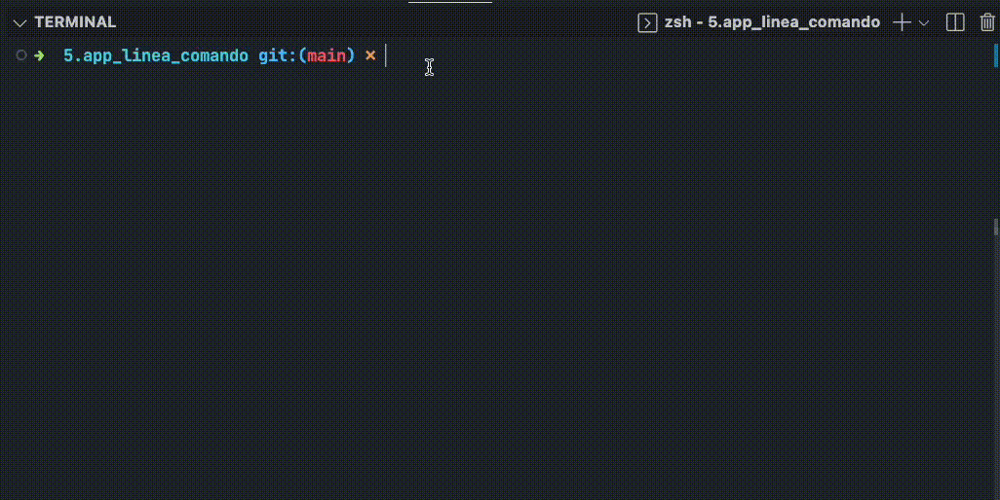

# Implementando el loop

Ya aprendimos cómo capturar _input_ del usuario. Ahora, tenemos que implementar la lógica básica de nuestro juego: el _loop_.

Sabemos que necesitamos se ejecute de forma indefinida hasta que el usuario ingrese una tecla para salir del juego. Qué conocen para hacer esto? 💀 Prueben implementar un loop infinito; pueden salir de él utilizando la combinación `cmd/ctrl + c`. Se vería así:

```dart
import 'dart:io';

void main() {
  while(true) {
    stdout.write('Rock, paper or scissors? (r/p/s): ');
    final userInput = stdin.readLineSync();
    print(userInput); 
    // recuerden utilizar `cmd/ctrl + c` para salir del loop       
  }
}
```

Bien! Esto no es muy útil pero sirvió para mostrarles cómo podemos __cortar la ejecución de un programa en la _command line_.__ Ahora vamos a implementar la lógica que queremos. 💀 Nuevamente, intenten ustedes implementar el _loop_ desde el _pseudo code_ que habíamos escrito:

```dart
import 'dart:io';

void main() {
  while (true) {
    stdout.write('Rock, paper or scissors? (r/p/s): ');
    final userInput = stdin.readLineSync();
    if (userInput == 'r' || userInput == 'p' || userInput == 's') {
      print('Selected: $userInput');
    } else if (userInput == 'q') {
      print('I hope you enjoyed the game! 😃');
      break;
    } else {
      print('Invalid input! 😳');
    }
  }
}
```

Deberían ver algo como esto:


